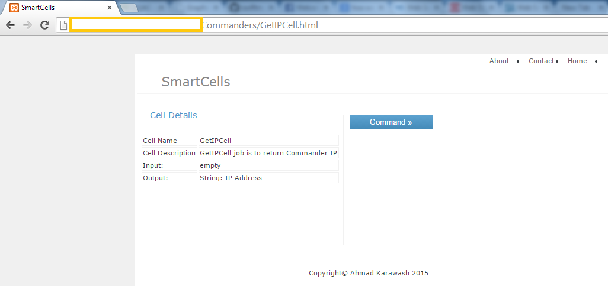
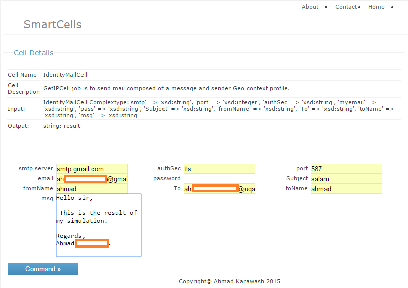

## SmartCells

SmartCells is a web app for intelligent distributed system. It is mainly based on building a center of instructions for Cloud Web services, 
known as a Cloud Brain. It is	capable to serve intelligently any request given by other machines (commanders) based on the Cells messaging properties.

Each Cell provide a specific kind of service, and keep tracking the availability of all the cloud web service that are under its service group. When a commander machine ask to process a job, a specified Cell uses the most available web service from the cloud to perform the job. It can collaborate with other Cells if the task require different kind of service. Also, Cells can ensure secure handle of task via showing details about the job execution. For example, let us consider the anonymous email problem, instead of recieving random emails without knowing the source, Cells provide the details about the overall context profile of the sender (like: location, real ip, ...).

